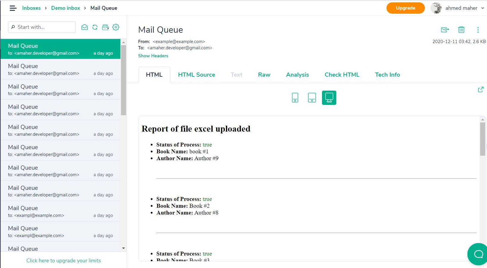

## Installation

- install composer of project: "composer install"
- install migration of database project: "php artisan migrate"
- run queue to make jobs in background: "php artisan queue:work"
- run unit test to check on code: "php artisan test"

## Coding

- all business logic in "Controller.php" class.
- all views in "welcome.blade.php" file.
- all models class in "Author.php, Book.php".
- all task that running in background in "Jobs/BooksStatusJob.php, Mail/BooksStatusMail.php"

## Resources

- all resources allocate in "./uploads" folder: 
1- books.xlsx use to import file to system.
2- mail_result.jpg is a screenshot of mail result send to sender.

## Mail result

## Tools

- Programming Language: PHP 7.2
- Framework: Laravel 7.30

